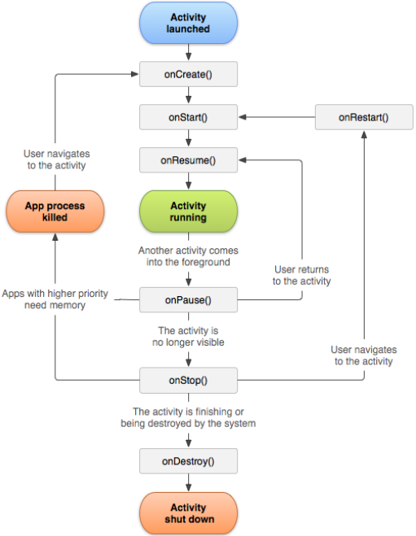
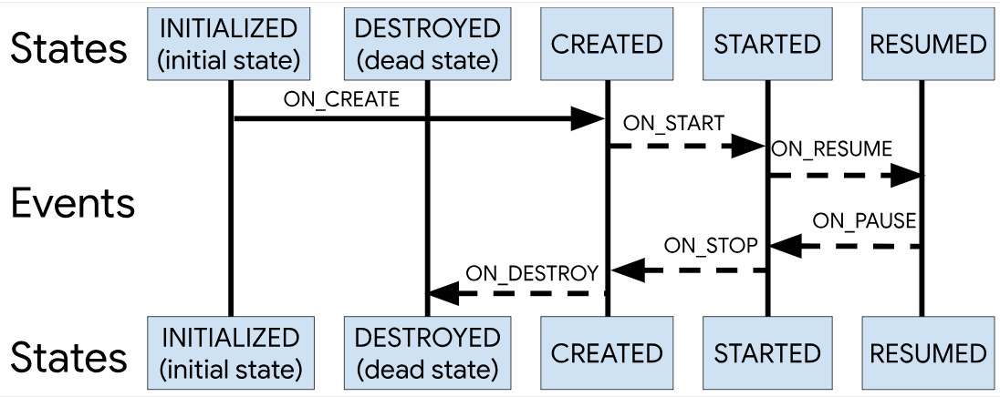
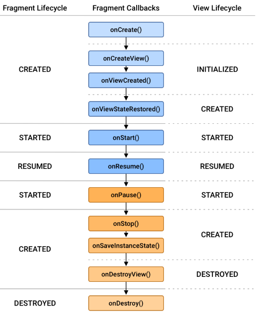

# Android LifeCycle

Activity 클래스는 6가지 콜백으로 이루어진 핵심 집합을 제공한다.

> 그림1 | Activity 생명주기

 

* 최초로 앱을 실행하면 `onCreate()`가 호출되는데 setContentView를 통해 View를 inflate한다. 이 콜백은 Activity가 메모리상에 올라갈 때 실행되기 때문에 Activity가 만들어지면서 최초에 단 한 번 실행되기 때문에 **View와 관련된 작업이나 리소스 초기화같은 작업** 을 하면 좋다.

* 다음으로 `onStart()`가 호출되는데 이 시점부터 사용자가 Activaty를 볼 수 있다. 그리고 액티비티가 실제 사용자와 상호작용이 가능한 foreground에 위치하면 `onResume()`이 호출된다. 이상태를 Activity가 실행 중인 것으로 본다.

* 반대로 Activity가 실행 중인 상태에서 사용자와 상호작용이 불가능한 상태, 즉 포커스를 잃은 상태가 되면 `onPouse()`가 호출된다.

* `onStop()`은 foeground에 있던 Activity가 background로 이동하여 더 이상 보이지 않을 때 호출된다. 시스템에서 메모리 부족시 background 상에 존재하는 앱들을 강제로 종료할 수 있기 때문에 **메모리에 할당된 리소스들 중 중요한 리소스들의 해제** 는 이 시점에 하는 것이 좋다.

* 그리고 Activity가 종료되거나 앱 프로세스 자체가 종료되면 `onDeatroy()`가 호출된다. 이 콜백이 호출되면 해당 Activity는 스택에서 pop된다.

  

## Activity State

> 그림2 | Android 활동 수명 주기를 구성하는 상태 및 이벤트

 

<h3> 기본적인 액티비티 전환 </h3>

* 최초에 Activity를 실행시키면 onResume까지 호출되면서 `RESUMED` 상태에 도달한다. 이 후, 새로운 Activity로 전환하면 기존 Activity는 포커스를 잃고 백그라운드로 전환되고, 새로운 Activity는 Activity 스택 최상단에 위치하면서 화면에 표시된다. 다시 기존 Activity로 전환하면 새로운 Activity는 Activity 스택에서 pop되기 때문에 `DESTROYED` 상태에 도달하면서 메모리에서 해제된다.

<h3> Dialog </h3>

Dialog는 작은 window이다. 즉, Activity와는 별개의 화면 구성 요소이기 때문에 Activity위에 Dialog가 생성되어도 스택에 push되지 않는다. Activity는 여전히 `RESUMED` 상태이다.

  

## Fragment Lifecycle

Fragment에는 더 많은 수명 주기 메서드가 있다. 수명 주기를 관리하기 위해 Fragment는 LifecycleOwner를 구현하여, getLifecycle() 메서드를 통해 액세스할 수 있는 Lifecycle 객체를 노출한한다.

> 그림3 | 프래그먼트 Lifecycle 상태와 프래그먼트의 수명 주기 콜백 및 프래그먼트의 뷰 Lifecycle와의 관계

 
