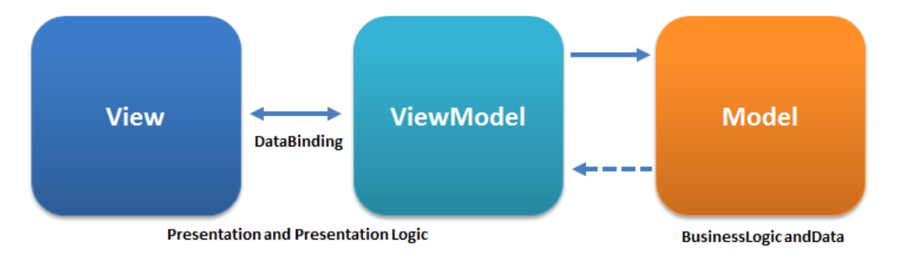

# Model - View - ViewModel

* UI 개발과 Business 로직을 분리하여 View가 어느 특정 모델 플랫폼에 종속되지 않도록 한다.

* 이러한 분리는 각 구성 요소의 **독립적인 개발**과 **테스트**를 가능하게 하며, 앱의 전체적인 구조를 더욱 견고하게 만든다.

* MVVM 패턴은 특히 데이터 바인딩을 통해 뷰와 뷰모델 사이의 상호작용을 간소화하며, 이는 코드의 양을 줄이고 가독성을 향상시킨다.

 

> 결론 ! 앱의 구조를 명확하게 분리하여 유지보수성과 확장성을 향상시키기 위함이다.

