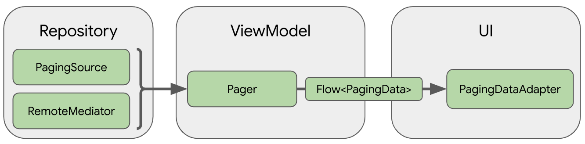

# Paging3 동작 원리

* Data Layer

  - 기본 라이브러리를 구성하는 객체는 `PagingSource`인데, `Repository`에서 네트워크 및 로컬 데이터베이스를 포함한 단일 소스에서 데이터를 로드할 수 있도록 한다.

* ViewModel Layer

  - `Pager`에게 전달하면 ViewModel에서 `PagingConfig` 구성 객체를 바탕으로 반응형 스트림에 노출되는 `PagingData` 인스턴스를 구성하기 위한 공개 API를 제공한다.

  - ViewModel 레이어를 UI에 연결하는 구성요소는 `PagingData`이다.

* UI Layer

  - UI 레이어의 기본 페이징 라이브러리 구성요소는 페이지로 나눈 데이터를 처리하는 RecyclerView 어댑터인 PagingDataAdapter

 

