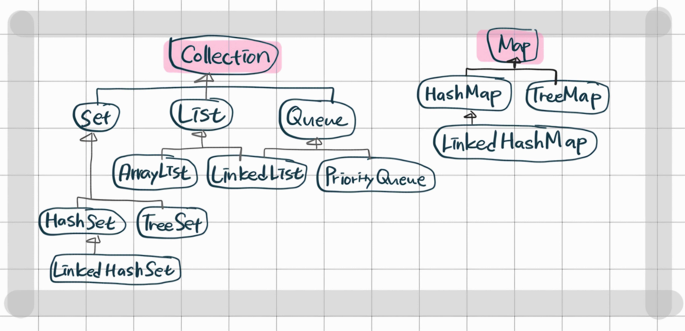

HashMap 이란?
===

* Key-Value로 짝을 이루어 데이터를 저장하는 Map 인터페이스를 구현한 맵클래스.

## HashTabe vs HashMap

* 동기화 여부
  - 해시맵은 동기화를 지원하지 않으나, 해시테이블은 동기화를 지원하기 때문에 여러 쓰레드에서 동시 접근이 가능하다.

* key나 value에 null 허용 여부
  - 해시맵은 null 혀용이지만, 해시테이블은 nulldmf허용하지 않는다.

## Hash 란 무엇일까?

* 임의의 데이터를 고정된 크기의 고유한 값(숫자 또는 문자열)으로 변환하는 것 (key-value)

    "apple" → 1934857  
    "banana" → 8273645

***key를 통해 값을 빠르게 찾을 수 있다.***

* 해시 알고리즘
  - O(1) 시간 복잡도