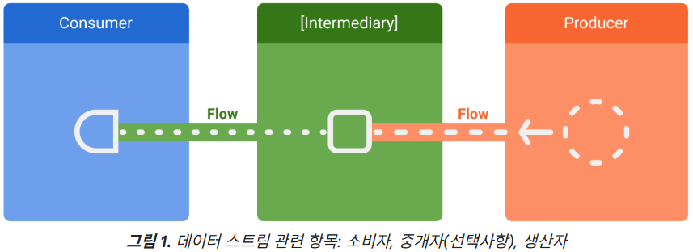

Flow
===
코틀린 코루틴의 일부.   
비동기 데이터 스트림을 처리하기 위한 도구이다.   

suspen fun 과 달리 여러 값을 내보내는 데이터 스트림이며, 코루틴 기반으로 빌드된다.   

* collectLatest
    - collectLatest는 현재 작업을 중지하고 최신 값을 수집한다.
    - 수신한 모든 값을 처리해야 하는 경우 collect를 사용하고, 최신 값만 처리 하려면 collectLatest를 사용한다.

    flow {
        emit(1)
        delay(50)
        emit(2)
    }.collectLatest { value ->
        println("Collecting $value")
        delay(100) // Emulate work
        println("$value collected")
    }

* StateFlow
    - StateFlow는 현재 상태와 새로운 상태 업데이트를 수집기에 내보내는 관찰 가능한 상태 홀더 흐름이다.

LiveData
===
안드로이드 아키텍처 컴포넌트의 일부.   
UI 생명주기를 인식하여 Data를 관찰할 수 있는 클래스이다.   

활동, 프래그먼트, 서비스 등 다른 앱 구성요소의 생명 주기 인식을 통해    
LiveData는 액티비티 생명 주기 상태에 있는 앱 구성요소 관찰자만 업데이트한다.   
(메모리 누수가 없어 safety하다.)   

### Flow와 LiveData의 가장 큰 차이는?  dependency의 여부!
liveData는 Lifecycle에 의존적이고, Flow는 Kotile 내장 dependency로 따로 추가하지 않아도 된다.   

또한 LiveData는 비동기 데이터 스트림을 처리하도록 설계되지 않았다.
